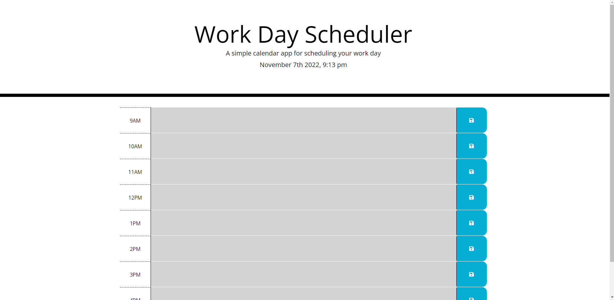
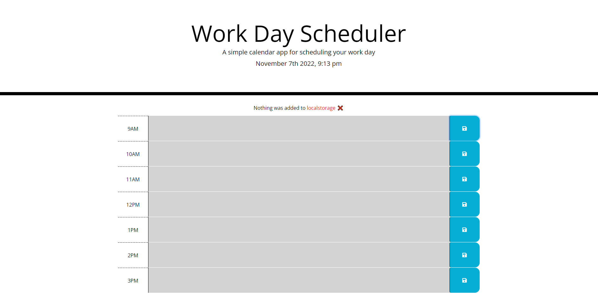
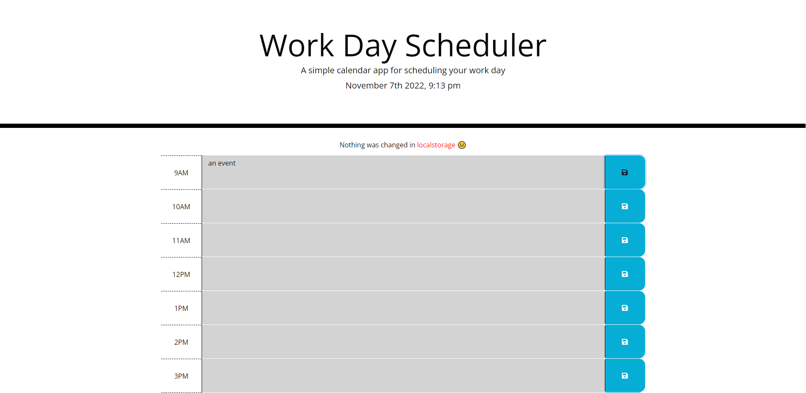
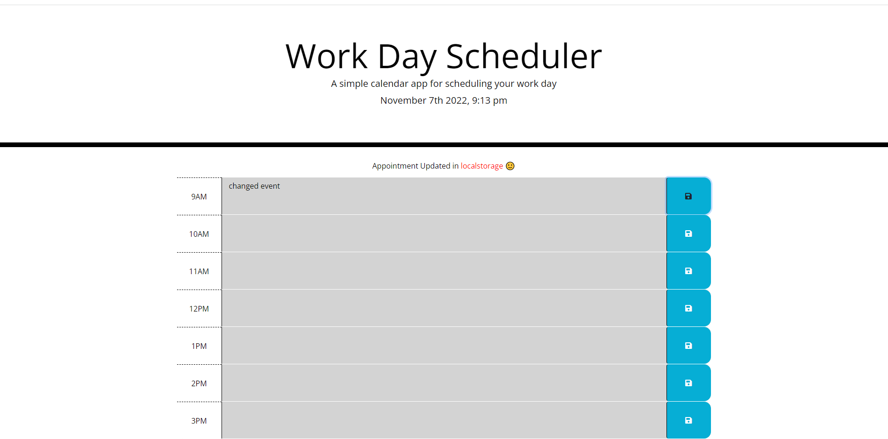

# Work Day Scheduler Starter Code

A website that a user can store input into a workday per time blocks.

## Viewed the source code; Started implementing functionality

* Upon first look at the source code there was no javascript code and nothing in the html implementing the time blocks. I created several rows in the html with save buttons and an update line to display what is going on behind the scenes to help the user understand functionality.

## Error detection; Making sure code would not crash

* I implemented a series of error checking to explain to the user what was happening and why that is displayed on the update section in the html.

# Links to deployed application

## GitHub repository for Module Challenge Three
[Github Repo](https://github.com/Quaz711/WorkDayScheduler)

## Live website for Module Challenge Three
[Live Website](https://quaz711.github.io/WorkDayScheduler/)